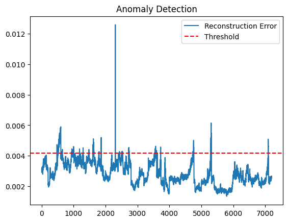
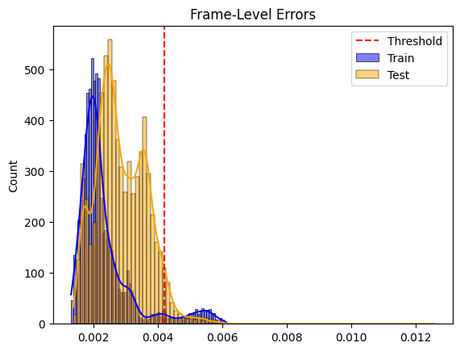
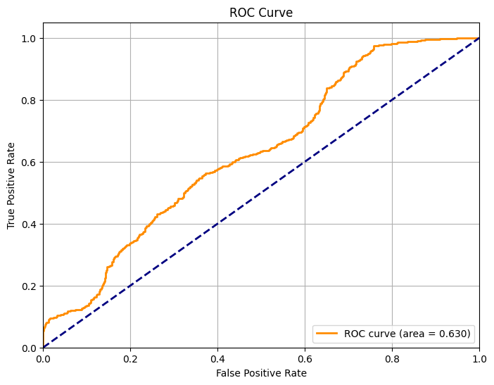

# 🚨 UCSD Ped1 Video Anomaly Detection using ConvLSTM Autoencoder

This project detects anomalous activities in surveillance videos using an unsupervised deep learning approach. We leverage a convolutional LSTM-based autoencoder to learn temporal patterns in normal video frames from the **UCSD Ped1 dataset**. Anomalies are detected based on high reconstruction error during inference.

---

## 📁 Dataset

- **Name:** UCSD Anomaly Detection Dataset - Ped1 subset
- **Description:** Contains surveillance videos of pedestrian walkways with occasional anomalies (e.g., bikes, vehicles).
- **Source:**
  - [UCSD Dataset](http://www.svcl.ucsd.edu/projects/anomaly/dataset.htm)
  - Ground truth: present in `TestXXX_gt` folders

---

## 🧠 Model Architecture

We use a **ConvLSTM Autoencoder** to reconstruct clips of video frames (shape: 10 × 224 × 224). Anomalies are detected based on reconstruction error.

**Architecture Highlights:**

- TimeDistributed Conv2D layers for spatial encoding
- ConvLSTM2D layers for temporal modeling
- TimeDistributed Conv2DTranspose layers for decoding
- Trained using Mean Squared Error loss

```text
Input: (10, 224, 224, 1)
↓
TimeDistributed(Conv2D) × 2 → ConvLSTM × 3
↓
TimeDistributed(Conv2DTranspose) × 2 → Output: (10, 224, 224, 1)
```

## 🔧 Project Structure
```
anomaly_detection/
│
├── src/
│   ├── __init__.py
│   ├── config.py                    # Constants and paths
│   ├── data_loader.py               # Preprocessing and data  loading
│   ├── model.py                     # ConvLSTM model definition
│   ├── train.py                    
│   ├── evaluation.py                # Prediction, ROC, histograms
├── notebooks/
│   └── main.ipynb                   # Development Notebook
│
├── model/
│   └── model.hdf5                   # Saved model
│
├── plots/
│   └── *.png                        # ROC, histogram, error curve plots
│
├── main.py                          # Entry point to run everything
├── requirements.txt
└── README.md
```

## 🧪 How It Works
1. Training Phase
* Model is trained on normal video clips only.
* Learns to reconstruct 10-frame grayscale clips.
2. Threshold Calculation
* On training data, reconstruction error is computed.
* Threshold = mean + 2 × std of training errors.
3. Testing Phase
* Model attempts to reconstruct test clips.
* High error ⇒ anomaly; Low error ⇒ normal.
4. Evaluation
* ROC AUC calculated using ground truth anomaly masks.
* Frame-level error plots & distributions shown.

## Results

* **Reconstruction Error Plot**
  * Any spike above the threshold is flagged as an anomaly.



* **Frame-Level Error Distributions**
  * Most test frames fall below the threshold, indicating:


    * The model is struggling to separate anomalous from normal behavior.
    * It may require:
      * More training epochs
      * Better hyperparameter tuning
      * Transfer learning or architectural improvements


* **AUC Interpretation**
An AUC of 0.63 indicates that the model has moderate discriminative ability. It performs better than random, but there's room for improvement in terms of capturing anomaly patterns more distinctly.



## Getting Started

1. Clone this repo
```
git clone https://github.com/gauravrsawant/Anomaly_Detection
cd ucsd-anomaly-detection
```
2. Install dependencies
```
pip install -r requirements.txt
```
3. Download UCSD Ped1 dataset from:
http://www.svcl.ucsd.edu/projects/anomaly/dataset.htm

4. Run Training & Evaluation
```
python main.py
```